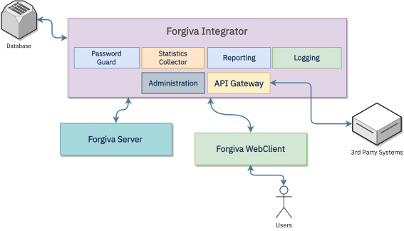
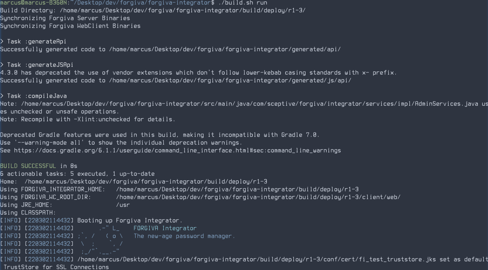

---

# Forgiva Integrator Configuration Guide

---

**Table of Contents**
  
- [Architecture](#architecture)
- [Building from Sources](#building-from-sources)
- [Docker Image Usage](#docker-image-usage)
  - [Customizing Configuration](#customizing-configuration)
- [Environment Variables](#environment-variables)
- [Periodic Backup](#periodic-backup)
- [Configuration file reference](#configuration-file-reference)
  - [Logging](#logging)
  - [Database Integration](#database-integration)
  - [Administration](#administration)
  - [Security](#security)
  - [Web Server](#web-server)
  - [Ldap Integration](#ldap-integration)
  - [Mail Server](#mail-server)
- [Support](#support)

## Architecture

<p align="center"></p>

Forgiva Enterprise consists of 3 major components;

### A. Forgiva Server

Forgiva Server is web service backend of password generation core developed in C. It is responsible to run core 
algorithm with relative parameters described within [algorithm](ALGORITHM.md). 

It only receives a JSON example document from both stdin and web service and returns back generated password as JSON.

For example it receives parameters as like; 

```json 
{
"host": "test.com",
"account": "administrator",
"animal": "Spider",
"character_length": 16,
"complexity": 1,
"is_lowercase": true,
"is_uppercase": true,
"is_symbols": true,
"is_number": true,
"password_hash": "EE26B0D...7F50028A8FF",
"renewal_date": "",
"signature": "",
"legacy_mode": false
}
```

and returns result as like;

```json
{
    "animal": "Spider",
    "password": "334a745e327a73562162716c79507b29"
}
```

For more details please refer to the Forgiva Server [repository](https://github.com/Sceptive/forgiva-server). 

### B. Forgiva WebClient

Forgiva WebClient (FWC) is the web user interface for the Forgiva Integrator (FI). It does not have any interaction with 
Forgiva Server and purposed to be an easy embedded interface for FI.

On build phase FI embeds distribution outputs of FWC into it's relative web server path and corellates with FI API 
gateway.  

For more details please refer to the Forgiva WebClient [repository](https://github.com/Sceptive/forgiva-webclient).

### C. Forgiva Integrator

Forgiva Integrator is the core integrator module of the whole Forgiva Enterprise solution family. It has centralized
logging and logging-integration facilities as well as user, staticstics and metadata storages as backend database.

It also has administrator interface to manage users and monitor system usage as well as biometric fingerprinting 
and SIEM integration reporting.


## Building From Sources

To build a runnable package you will need;

- Unix/Linux environment
- Maven build automation tool
- Java 1.8 JDK environment
- Docker Containerization Toolkit

installed.

```                                                                             
$ ./build.sh run
```

command will be building whole project into the build/deploy/[version]/
path and synchronizing web client (client/web/dist) and Forgiva Server binary releases
into the relative target path. And starts the Forgiva Integrator instance.

And you should see an output similar to below;

<p align="center"></p>

Then you can switch to https://localhost:8443 to log in.

### Create Release Package

```
$ ./build.sh release
```

Will be creating **forgiva_integrator-$VER-jvm8-release.tar.xz** release file on
root folder.

### Create Docker Image

```
$ ./build.sh image
```

To run the created forgiva-integrator image
```
$ docker run -p 8443:8443 forgiva-integrator:latest
```

## Docker Image Usage

You can launch Forgiva Integrator detached quickly with its container image;

```shell
$ docker run -ti -p 8443:8443 -d --name forgiva forgiva-integrator:latest 
```
It will be creating random credentials (if defaults is used) for both administrator and user.

```
$ docker logs forgiva
...
[INFO] Created default account and save credentials at /opt/forgiva-integrator/data/upwd.txt . Please change after login.
[INFO] It is detected that default password is set. Admin access credentials are changed and saved to  /opt/forgiva-integrator/data/apwd.txt
```

You can get access user and administrator credentials by accessing files with;

```shell
$ docker exec -ti forgiva cat /opt/forgiva-integrator/data/upwd.txt
forgiva_defj : d029jd2+#2..d30R
```
and

```shell
$ docker exec -ti forgiva cat /opt/forgiva-integrator/data/apwd.txt
admin_mf30 : -d230k3k()-+M31
```
### Customizing configuration

To customize configuration you can set either 
* configuration path to a path you set up outside of the container and mount it into the 
**/opt/forgiva-integrator/conf** path

```shell
docker run -ti -d -p 8443:8443 \
      -v <configuration-path>:/opt/forgiva-integrator/conf \
      --name forgiva \
      forgiva-integrator:latest 
```

* change configuration path with environment variable FORGIVA_INTEGRATOR_CONF_LOCATION to a mounted directory including
configuration files.

```shell
docker run -ti -d -p 8443:8443 \
      -e FORGIVA_INTEGRATOR_CONF_LOCATION=/etc/forgiva
      -v <configuration-path>:/etc/forgiva \
      --name forgiva \
      forgiva-integrator:latest 
```
The key file for configuration is **integrator.conf** located within **conf** directory. To fully customize all 
variables Forgiva Integrator using you should just clone and edit the **integrator.conf** and mount it along with the 
custom configuration path.

```shell
$ docker run --ti -d --name forgiva forgiva-integrator:latest
$ mkdir custom
$ docker cp forgiva:/opt/forgiva-integrator/conf/ custom
$ vi custom/integrator.conf
$ # Make relevant changes
$ docker stop forgiva && docker rm forgiva
$ docker run -ti -d <other-configuration-options> -v $(pwd)/custom/:/opt/forgiva-integrator/conf \
      --name forgiva \
      forgiva-integrator:latest 
```
You can additionally redirect default H2 database file to a host directory to backup manually or protect out with 
-just like conf directory specification- either changing environment variable **FORGIVA_INTEGRATOR_DATA_LOCATION**
or mounting **/opt/forgiva-integrator/data** directory out.

For example:

```shell
docker run -ti -d <other-configuration-options> \
      -v <host-path>:/opt/forgiva-integrator/data \
      --name forgiva \
      forgiva-integrator:latest
```

## Environment variables

If you set variables below to any other value you want then Forgiva Integrator will be using those variables as default.

| Variable Name                    | Description                                                                                                                 |
|----------------------------------|-----------------------------------------------------------------------------------------------------------------------------|
| FORGIVA_INTEGRATOR_HOME          | Home path of Forgiva Integrator<br/>By default it is /opt/forgiva-integrator and all other directories are relative to home |
| FORGIVA_INTEGRATOR_CONF_LOCATION | Configuration files path<br/>By default it is [home directory]/conf                                                         |
| FORGIVA_INTEGRATOR_LOGS_LOCATION | Log files path<br/>By dfault it is [home directory]/logs                                                                    |
| FORGIVA_INTEGRATOR_DATA_LOCATION | Data files path<br/>By default it is [home directory/data                                                                   |

## Periodic backup

Due to sensitivity of the metadatas using in the Forgiva Enterprise, it is recommended to backup database 
periodically against doomsday scenarios.

There are various solutions for backing-up and restoring but we can recommend [Volumerize](https://github.com/blacklabelops/volumerize) 
to simplify backups to any target you might direct such as; 

* Filesystem
* Amazon S3
* DropBox
* Google Drive
* ssh/scp
* rsync

Please refer to the Volumerize repository for more details.

Easing backup procedures by creating volumes and mounting certain volumes to Forgiva Integrator should be easiest way.

You can create both configuration and data volumes and launch with

```shell
$ docker volume create forgiva-data
$ docker volume create forgiva-conf

# Don't forget to copy and edit configuration files on forgiva-conf volume
# $ docker run -ti -d --name forgiva forgiva-integrator:latest
# $ docker cp forgiva:/opt/forgiva-integrator/conf /tmp/fconf
# $ docker stop forgiva && docker rm forgiva
# $ docker run -v forgiva-conf:/data --name bridge busybox true
# $ docker cp /tmp/fconf/integrator.conf bridge:/data
# $ docker cp /tmp/fconf/<other-files> bridge:/data

$ docker run -ti -d <other-configuration-options> \ 
      -v forgiva-data:/opt/forgiva-integrator/data \
      -v forgiva-conf:/opt/forgiva-integrator/conf \
      --name forgiva \
      forgiva-integrator:latest
```

To backup to any target over Volumerize you can refer to the backup container startup command example below;

```bash
docker run -d \
    --name fi-volumerize \
    --restart always \
    -v forgiva-data:/fi-data:ro \
    -v forgiva-conf:/fi-conf:ro \
    -v volumerize_cache:/volumerize-cache \
    -e "VOLUMERIZE_SOURCE1=/fi-data" \
    -e "VOLUMERIZE_TARGET1=dpbx:///fi-data-backup" \
    -e "VOLUMERIZE_SOURCE2=/fi-conf" \
    -e "VOLUMERIZE_TARGET2=dpbx:///fi-conf-backup" \
    -e "DPBX_ACCESS_TOKEN=deR....aMn" \ # Dropbox Access Token
    -e "VOLUMERIZE_JOBBER_TIME=0 0 */6 * * *" \ # Backup cron (Every 6 hours)
    -e "VOLUMERIZE_FULL_IF_OLDER_THAN=1D" \ # Make sure to get full backups everyday
    blacklabelops/volumerize 
```
The container above backs up database every 6 hours to the Dropbox. And you can restore backups manually by invoking;

```shell
docker run --rm \
    -v forgiva-data:/source1 \
    -v forgiva-conf:/source2 \
    -v cache_volume:/volumerize-cache \
    -e "VOLUMERIZE_SOURCE1=/source1" \
    -e "VOLUMERIZE_TARGET1=dpbx:///fi-data-backup" \ 
    -e "VOLUMERIZE_SOURCE2=/source2" \
    -e "VOLUMERIZE_TARGET2=dpbx:///fi-conf-backup" \ 
    -e "DPBX_ACCESS_TOKEN=deR....aMn" \ # Dropbox Access Token
    blacklabelops/volumerize  restore
```


## Configuration file reference

### A. Logging

When Forgiva gets launched it outputs logs to console as well as logs/debug.log and logs/console.log if configured.

You can choose the output format with **LOGGING_OUTPUT_FORMAT** parameter and define log size for rolling with
**LOGGING_MAX_LOG_SIZE** parameter.

| Parameter                  | Description                                                                                                                                                                                                   |
|----------------------------|---------------------------------------------------------------------------------------------------------------------------------------------------------------------------------------------------------------|
| LOGGING_OUTPUT_FORMAT      | Indicates which format will be used on logging outputs<br/>Available options: JSON or PLAIN                                                                                                                   |
| LOGGING_GENERATE_DEBUG_LOG | If enabled creates debug.log in the log folder                                                                                                                                                                |
| LOGGING_MAX_LOG_SIZE       | When file size exceeds the specified amount then rolls the file to a <br/>file with timestamp and creates a new file. Size can include K, M nd G <br/> values respectively to Kilobyte, MegaByte and GigaByte |

### B. Database Integration

Forgiva Integrator can run with embedded H2 database as well as other databases pointed remotely. For configuration
to database connection **DB_JDBC_URL** with relative driver class name (**DB_JDBC_DRIVER**) and credentials will
be enough to integrate.

Databases below should work seamlessly with Forgiva Integrator;

* Oracle
* MySQL
* PostgreSQL
* Derby
* DB2
* Microsoft SQL Server
* Sybase
* Informix
* SQL Anywhere
* HSQL
* SAP HANA
* H2
* Firebird
* Microsoft Access
* Attunity
* Cloudscape
* DBase
* PointBase
* TimesTen
* Symfoware
* MaxDB

| Parameter        | Description                                                                                                                                                                                                                                                                        |
|------------------|------------------------------------------------------------------------------------------------------------------------------------------------------------------------------------------------------------------------------------------------------------------------------------|
| DB_JDBC_DRIVER   | Standard JPA 2.0 JDBC driver class name for JSE deployments                                                                                                                                                                                                                        |
| DB_JDBC_URL      | Standard JPA 2.0 JDBC URL for JSE deployments.May include **${data_path}**, **${home_path}**, **${logging_path}** or **${conf_path}** substitutions to indicate absolute db path relative to relevant Integrator path configurations for file databases (such as Sqlite,  H2 etc.) |
| DB_JDBC_USER     | Database user                                                                                                                                                                                                                                                                      |
| DB_JDBC_PASSWORD | Database password                                                                                                                                                                                                                                                                  |


### C. Administration

As a security precaution for Administrator credentials for cases on any database breaches we hold it 
in the configuration file for only file-system access.

If default credentials is set then Forgiva Integrator automatically changes and saves credentials to the data folder
as apwd.txt file.

| Parameter                  | Description                                                                                                                                                                 |
|----------------------------|-----------------------------------------------------------------------------------------------------------------------------------------------------------------------------|
| ADMINISTRATOR_USERNAME     | User name for administrator account                                                                                                                                         |
| ADMINISTRATOR_PASSWORD     | Hashed and or derived password specified with SECURITY_PW_HASHING_MODEL andd SECURITY_DEFAULT_HASHING which will generate it respective to SECURITY_HASHING_SALT parameter. |
| ADMINISTRATOR_IP_ADDRESSES | Ip addresses dedicated to administrator account. Multiple IPs can be spearated with comma (,) sign.                                                                         |

### D. Security

Please be aware that there are two hashing model definitions in Forgiva Integrator;

* First, as specified with **SECURITY_PW_HASHING_MODEL** parameter is used for password storages for User and/or 
Administrator passwords
* Second, as specified with **SECURITY_DEFAULT_HASHING** is getting used in Forgiva algorithm.

When a client sends a password over API to the Forgiva Integrator, it uses **SECURITY_DEFAULT_HASHING** model but 
when it is required to store any password to the database **SECURITY_PW_HASHING_MODEL** is getting used.

Both models support algorithms below;

SHA512, SHA384,SHA256, SHA3-512, SHA3-384, SHA3-256, BLAKE2B-512, BLAKE2B-384, BLAKE2B-256, SM3

Additionally **SECURITY_PW_HASHING_MODEL** supports [SCRYPT](https://www.tarsnap.com/scrypt.html), 
[BCRYPT](https://www.openwall.com/crypt/) and [ARGON2](https://github.com/khovratovich/Argon2).

The main idea behind the motivation of hash algorithm combining is creating barriers in between hash algorithms against
collision attacks. You can think modelling as mathematically interconnecting hash functions like;

```
 A+B+C+D =>
 
 A(B(C(D(<password)))) = <result> 
 
```

So any collision within either hash function does not directly impact to the outcome. 

And additionally as specified in the configuration file;

**After setting security options and creating user(s) and setting administrator account, it will  not be possible
to change the security options  without resetting all user and  administrator passwords because 
Forgiva Integrator DOES NOT saves any password to anywhere unless hashing  it with model(s) specified within 
configuration file and it is not possible to backward the process.**

| Parameter                       | Description                                                                                                                                                                                                   |
|---------------------------------|---------------------------------------------------------------------------------------------------------------------------------------------------------------------------------------------------------------|
| SECURITY_PW_HASHING_MODEL       | Indicates the combination and/or definition of key derivation and hashing functions to hold hashes for various purposes. Order is important and you should separate algorithm definitions with plus (+) sign. |
| SECURITY_PW_HASHING_SALT        | Salt to get used for hashing purposes with hashing model. Should be random and unique.                                                                                                                        |
| SECURITY_DEFAULT_HASHING        | Default hashing algorithm to use on necessary steps.                                                                                                                                                          |
| SECURITY_DEFAULT_HASHING_SALT   | Default hashing salt to get used in . Should be random and unique.                                                                                                                                            |
| ARGON2_PARAMETERS               | Argon2_i algorithm parameters separated with colon (:) characters.<br/>Definition:  ITERATIONS:MEMORY:PARALLELIZATION                                                                                         |
| SCRYPT_PARAMETERS               | SCrypt algorithm parameters separated with colon (:) characters.<br/>Definition:  MEMORY:BLOCK_SIZE:PARALELIZATION                                                                                            |
| BCRYPT_COST                     | BCrypt algorithm parameter which grows the cost of the function as 2^cost. Legal values are 4..31 inclusive                                                                                                   |
| SECURITY_PW_MIN_ENTROPY         | Minimum password entropy bits.A password entropy indicates strength  against raw brute-force attacks. Minimum of 64-bit entropy required by default.                                                          |
| SECURITY_PW_PROHIBITED_WORDLIST | Blacklisted words and/or password samples which will get prohibited by the Forgiva Integrator. It should be in .gz / .bz2 / .7z or .xz format file placed in the conf directory.                              |


### E. Web Server

Forgiva Integrator runs embedded web server and serves both Forgiva WebClient content and APIs over the web server. It's
important to use valid and verifiable certificates on HTTPS but depending on the architecture self signed certificates
can also be used.

If you have any existing valid SSL certificate you can import it into keystore file with **keytool** command like;

```shell
$ keytool -import -v -trustcacerts \
    -alias forgiva_integrator -file <certificate>.cer \
    -keystore <keystore_file>.jks -keypass <certificate-password> \
    -storepass <keystore-password>
```
Also if you want to launch a self-signed certificate with keytool you can run;

```shell
keytool -genkey -alias forgiva_integrator \
      -keyalg RSA -keypass <certificate-password> \
      -storepass <keystore-password> -keystore <keystore_file>.jks
```

If it gets necessary you can export generated/imported certificate with;

```shell
keytool -export -alias forgiva_integrator \
      -storepass <keystore-password> \
      -file <output>.cer \
      -keystore <keystore_file>.jks
```
Please note that alias **forgiva_integrator** should be key in whole keystore operations.

| Parameter               | Description                                                         |
|-------------------------|---------------------------------------------------------------------|
| HTTPS_PORT              | Port number of HTTPS gateway.                                       |
| HTTPS_HOST              | Host to bind port to.                                               |
| HTTPS_SSL_KEYSTORE_FILE | .JKS KeyStore file containing SSL Keys Respective to conf directory |
| HTTPS_SSL_KEYSTORE_PASS | .JKS KeyStore file password                                         |
| HTTPS_SSL_CERT_PASS     | Certificate password located in JKS File                            |
   

### F. LDAP Integration

Forgiva Integrator supports LDAP integration for enterprises with big directories. If any LDAP server is configured
then on login Forgiva Integrator first seeks out to LDAP server for a valid authentication and fails if not.

| Parameter   | Description                                                         |
|-------------|---------------------------------------------------------------------|
| LDAP_SERVER | LDAP Servers with ldap:// or ldaps:// headers separated with commas |
| LDAP_DOMAIN | Domain Name to use filtering out user details on LDAP server        |

### G. Mail Server

If e-mail address is defined with users by administrator then if administrator wants user to reset user's password it
is required to use SMTP server to send reset e-mail to user.

| Parameter           | Description                                                                             |
|---------------------|-----------------------------------------------------------------------------------------|
| SMTP_SERVER         | Mail server address starts with smtp://, smtps:// or stmp_tls://  with host:port couple |
| SMTP_USERNAME       | Username to authenticate SMTP server                                                    |
| SMTP_PASSWORD       | Password to use for smtp authentication                                                 |
| SMTP_FROM           | "From" address to get used in mail sender part                                          |
| SMTP_PROXY_HOST     | Proxy host with port combination (host:port) to access mail server                      |
| SMTP_PROXY_USERNAME | Username to authenticate proxy                                                          |
| SMTP_PROXY_PASSWORD | Password to use in proxy authentication                                                 |

## Support

For any support and assistance please get in touch with Harun Esur at

harun (dot) esur [at] sceptive (dot) com
or
harun (dot) kozmot (dot) com
