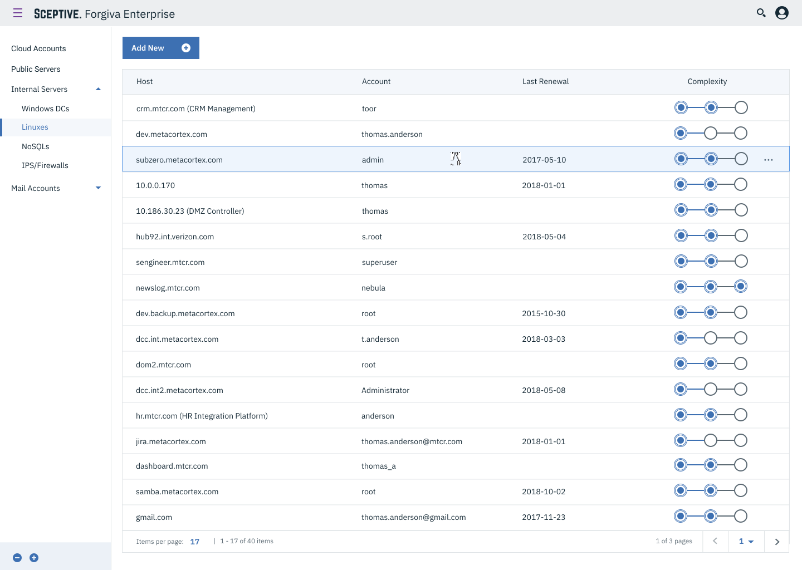
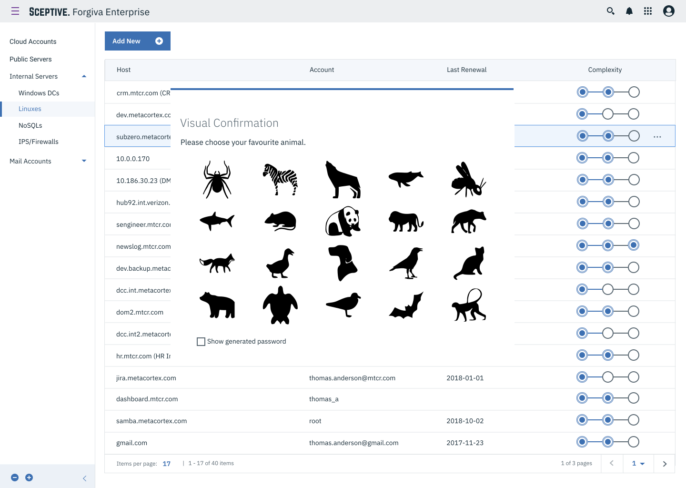
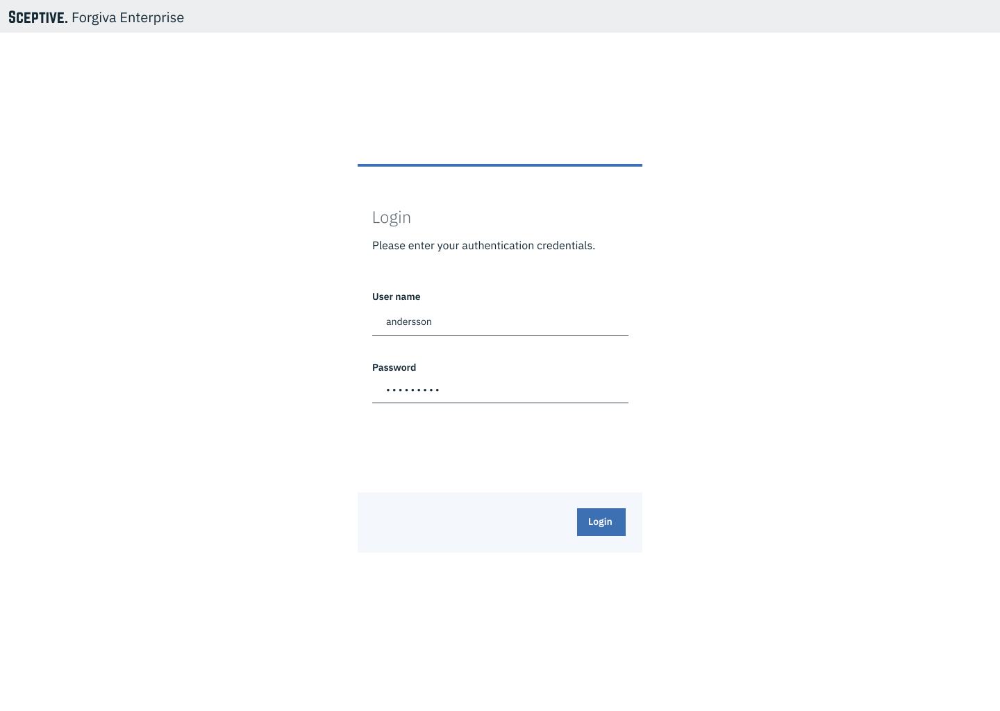
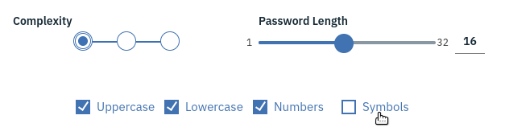
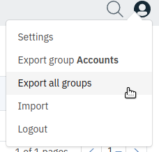
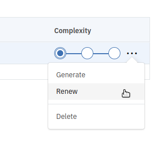

# Forgiva Integrator

<p align="center"></p>

## INTRODUCTION

Forgiva Enterprise is a set of components for a secure and efficient method of 
re-generation of passwords each time through the cryptographic hash and encryption algorithm(s) 
of the relevant metadata on the assumption that as long as fixed metadatas with fixed algorithms
can generate same passwords so that storing any password becomes unnecessary. This method is 
classified as **stateless** or **deterministic** password management.

Thus; 

 * storing passwords to any medium (encrypted vaults etc.) becomes unnecessary and relevant cyber-security threats no longer poses any risk
 * a certain method of resistance emerges for rubber-hose crypto cryptanalysis attacks (torture, coercion etc.) 
due to any key can generate another password so users can plausibly deny knowing master-key
 * enterprise configurations of the passwords generates corporate specific keyspace to create a black-box against the attackers
 * visual metadata system adds protection to itself for malwares and keyloggers.

<p align="center"></p>


Also depending on the corporate password policies, Forgiva Enterprise guarantees that passwords 
are generated without any need for inspection and in line with the conditions defined by the central 
decision-making points.

Forgiva Enterprise fixes most of the arguments against stateteless/deterministic password managers. Please refer 
to the FAQ section for more questions. 

Forgiva Integrator is the core module of Forgiva Enterprise. It connects Forgiva Server to Forgiva WebClient on 
password generation processes and integrates other Forgiva Enterprise features with the network running 
over such as LDAP, FORHash and  other various integrations.   


## Fast Start

You can launch Forgiva Integrator detached quickly with it's container image;

```shell
$ docker run -ti -d -p 8443:8443 --name forgiva forgiva-integrator:latest 
```
It will be creating random credentials (if defaults is used) for both administrator and user.

```
$ docker logs forgiva
...
[INFO] Created default account and save credentials at /opt/forgiva-integrator/data/upwd.txt . Please change after login.
[INFO] It is detected that default password is set. Admin access credentials are changed and saved to  /opt/forgiva-integrator/data/apwd.txt
```

You can get access user and administrator credentials by accessing files with;

```shell
$ docker exec -ti forgiva cat /opt/forgiva-integrator/data/upwd.txt
```
and 

```shell
$ docker exec -ti forgiva cat /opt/forgiva-integrator/data/apwd.txt
```

Then please redirect your browser to https://localhost:8443 to access Forgiva Enterprise Web Client.

<p align="center"></p>

You can log in into same interface with both administrator and user credentials.

For more details and customization options please refer to the [docker image usage section](CONFIGURATION.md#docker-image-usage) 
in [configuration](CONFIGURATION.md) documentation.

## FAQ

### Q: What makes Forgiva Enterprise better against other stateless/deterministic password managers?

For the start Forgiva is not a key-derivation algorithm but a "combination algorithm" which generates way-much 
stronger keys other than bcrypt, scrypt and argon2.

Most of the stateless password managers just uses one type of key-derivation algorithms but Forgiva uses 
a lot of encryption and hashing algorithms depending on the master-key. 

Tying algorithm order with master-key makes it impossible to determine an estimation time (and processor cost) 
for a brute-force attack session. This puts Forgiva Enterprise one step beyond others. 
  
Please take a look at iterative-hashing and iterative-encryption methods at [algorithm documentation](ALGORITHM.md) .

### Q: What about common arguments against stateless/deterministic password managers?

Forgiva Enterprise has been developed especially for bypassing some arguments related to stateless password managers which
you can take a look at [here](http://security.stackexchange.com/questions/94106/is-this-idea-for-a-password-manager-secure-if-so-why-doesnt-anybody-use-it)
and [here](http://security.stackexchange.com/questions/55592/password-managers-encrypted-database-vs-hashing-strategy).

Forgiva surpasses most of the arguments against the idea and presents stateless password managing as a great method to 
get protected.

### Q: If master key does gets compromised all your passwords gets compromised. 

This problem is also resides with all encrypted vaults and password managers. And all encrypted vaults prones to the 
brute-force attacks but Forgiva Enterprise is way-way more strong against brute-force attacks and additionally offers 
deniable knowledge on rubber-hose cryptoanalysis attacks (like torture, coersion etc.) .

### Q: Managing sites with restrictive password requirements is very difficult

This was a problem with initial versions of Forgiva but resolved in Forgiva Enterprise, users can specify password
policies by themselves, from PIN number to case and symbol group choices.

<p align="center"></p>

### Q: Changing site-specific passwords requires remembering additional site-specific information
### Q: It's not always obvious what site name to use as the input for the hash function

All metadatas are getting stored within custom configured databases of user's choice and can get backed-up regularly.

Backing up and restoring metadatas got easier with export and import functionalities and additionally users can backup 
all of their metadatas over configured databases periodically.

<p align="center"></p>


So no additional remembering is needed other than master-password. 

### Q: Changing the master password is inconvenient

With renewal mechanism developed in Forgiva Enterprise there is no incovenient way of password renewal.

<p align="center"></p>


### How does it protect me better against malware?

Malwares do hijack your interaction with computer and try to fetch all the actions you make to unlock authorizations.

First and foremost they track your keyboard and get key sequences to determine the password you enter. And if it is 
possible on some cases they hijack into application memory to dump stored master-keys.

With Forgiva Enterprise, we understand this risk and we put counter-measures to harden theft attacks. We put 
visual confirmation mechanism and we put customization mechanisms. By those, even a malware steals your master-key 
it is not enough to re-generate your passwords somewhere else. It should find out (by monitoring your screen) your 
visual confirmation pattern and server side customization data (by accessing your servers ).

By these measures, Forgiva protects you much better than other major password managers.

### Lets say my visual confirmation pattern understood and certificate is stolen and  a generated password of mine is acquired from a malicious site. How long does it take to crack my master-key?

Practically it would take at least a few life-times if you use a good master-password with 60 bits minimum.

Let's consider the account of Bill Gates with "facebook.com" host, "bill.gates@microsoft.com" account and "forgiva is the best" password. on a Macbook Pro 2014 

To crack a password with 73 bit entropy it would take ~6 million years to complete all combinations on **Normal complexity**.

On **Intermediate complexity** it will take ~24 million years and on **Advanced complexity** it will take ~280 million years to reach all combinations at minimum.


## Features to add

- Forgiva Server Host Mode integration
- ForHash (black-box hashing API)
- Biometric fingerprinting 
- SIEM integrations
- Mobile interfaces
- 2FA login
- Password reset functionality

## Support

For any support and assistance please get in touch with Harun Esur at

harun (dot) esur [at] sceptive (dot) com
or
harun (dot) kozmot (dot) com


